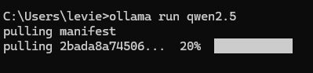
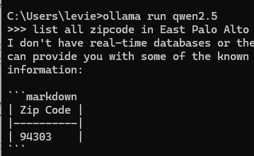
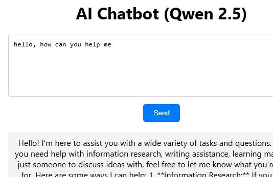

# Ideal: Create a chatbot local machine with Qwen2.5.

## Steps:

- Setting up Ollama and Qwen 2.5 on a local machine.
- Using FastAPI to create a chatbot backend.
- Creating a react.js at front end for user interaction.

* use axios package to make API request.

### Tool, language and AI Model support:

- V.S Code
- Python , React (JS)
- Ollama, Qwen2.5 (model)

### Library:

- axios package
- uvicorn==0.34.0, fastapi

**Step 1:**

- Install ollama
- Download Qwen 2.5 Model
- Test the Qwen 2.5 Model

_1.1 Install ollama_

- download ollama from ollama.com
- download Qwen2.5 model at: <a href="https://ollama.com/library/qwen2.5">ollama 2.5 download</a>
  or run commend at cmd
  > `ollama run qwen2.5` > 

_1.2 test qwen2.5 works or not_
type in :

> `ollama run qwen2.5`
> Let ask any question and see the answer.
> 

**Step 2:** Setup Python environment and create FastApi,
uvicorn server:app --reload --host 127.0.0.1 --port 8000 PI backend, then run the backend.
_2.1 Create project using V.s Code, python_

```
mkdir qwen_chatbot
cd qwen_chatbot
```

Open V.S Code terminal, and create virtual environment
`python -m venv myvenv`
`.\myvenv\Scripts\activate` ## activate,keep dependency lib in virtual environment
Install uvicorn library
`pip install uvicorn`
_2.2 run command at V.S code terminal_
uvicorn server:app --reload --host 127.0.0.1 --port 8000

open web browser, and type in address: 127.0.0.1:8000

- Test POST request, with message: Hello AI!

**Step 3**: Create frontend and connect backend via API

- Setup React app
- Create Chat UI, Style the Chat UI
- Run and test
  3.1 Setup React app
- Install node.js
- Create new react application named "qwen_chatbot_ui"

```
  cd qwen_chatbot
  npx create-react-app qwen_chatbot_ui
  cd qwen_chatbot_ui
  npm install axios ##install axios package
```

axios, is package support http request, post, get through API

3.2 change file App.js

```
import React, { useState } from "react";
import axios from "axios";
import "./App.css";

function App() {
const [message, setMessage] = useState("");
const [response, setResponse] = useState("");

const sendMessage = async () => {
try {
const res = await axios.post("http://127.0.0.1:8000/chat", { message });
setResponse(res.data.response);
} catch (error) {
console.error("Error:", error);
setResponse("Error getting response from AI.");
}
};

return (
<div className="chat-container">
<h1>AI Chatbot (Qwen 2.5)</h1>
<textarea
value={message}
onChange={(e) => setMessage(e.target.value)}
placeholder="Type a message..."
/>
<button onClick={sendMessage}>Send</button>
<div className="response">{response}</div>
</div>
);
}

export default App;
```

file App.js

```
.chat-container {
max-width: 600px;
margin: 50px auto;
padding: 20px;
border-radius: 8px;
box-shadow: 0 0 10px rgba(0, 0, 0, 0.1);
text-align: center;
}

textarea {
width: 100%;
height: 100px;
padding: 10px;
margin-bottom: 10px;
border-radius: 5px;
border: 1px solid #ccc;
}

button {
padding: 10px 20px;
border: none;
border-radius: 5px;
background-color: #007bff;
color: white;
cursor: pointer;
}

.response {
margin-top: 20px;
padding: 10px;
background: #f4f4f4;
border-radius: 5px;
}
```

**3.3 Run**
at terminal,

```
cd qwen_chatbot_ui
npm start
```

open link http://localhost:3003
Just ask question from chat box, and wait for result:

